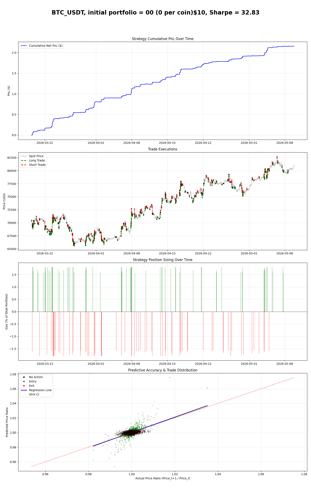
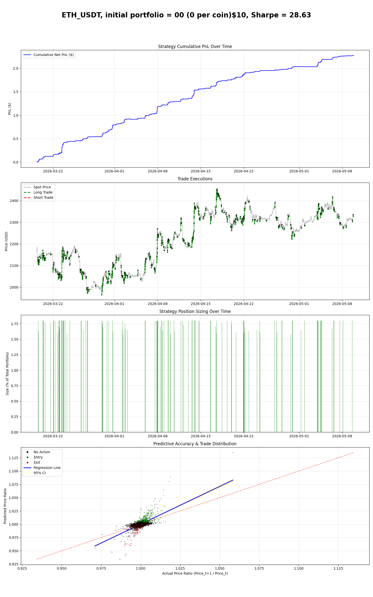
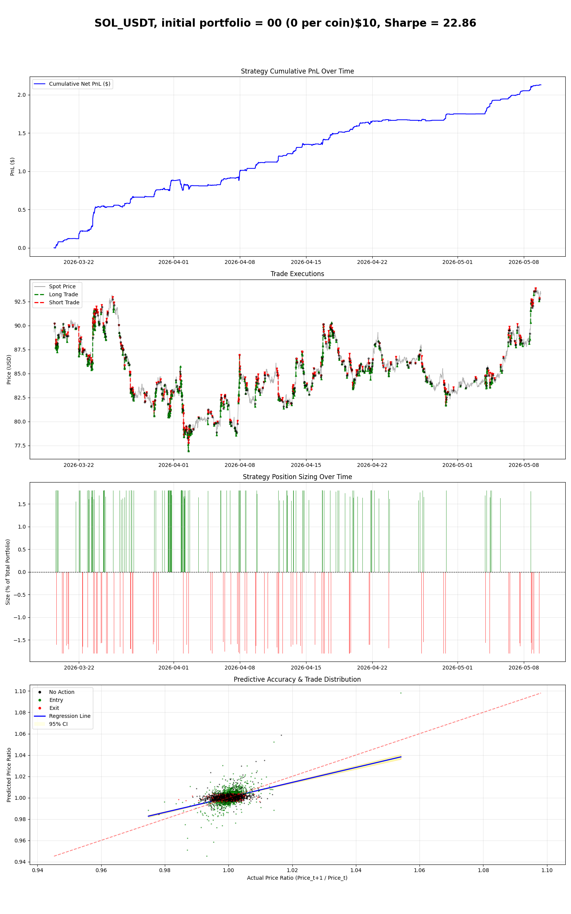
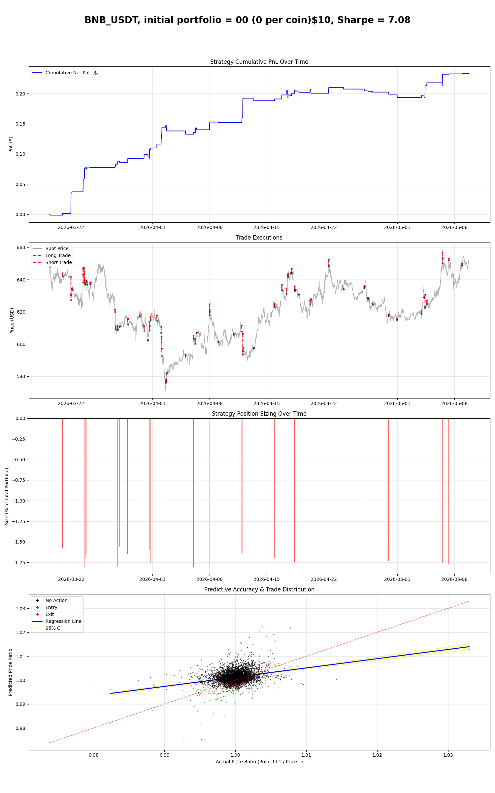
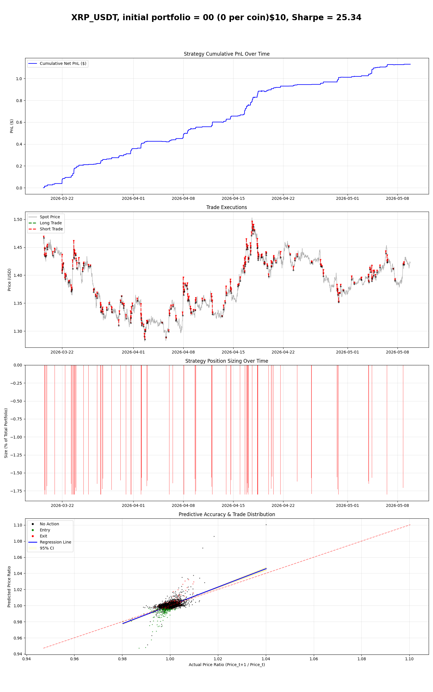
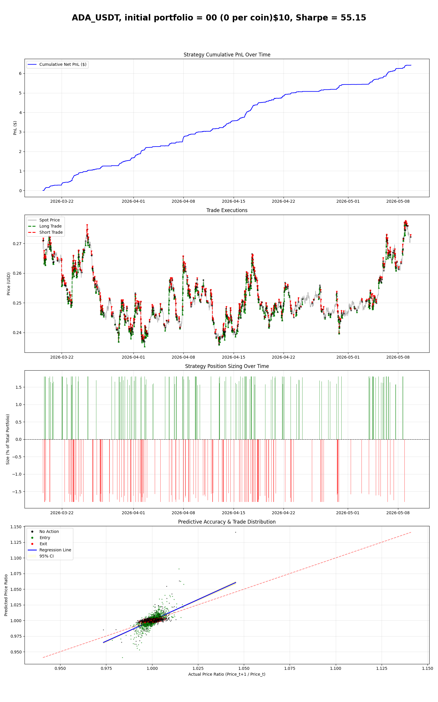
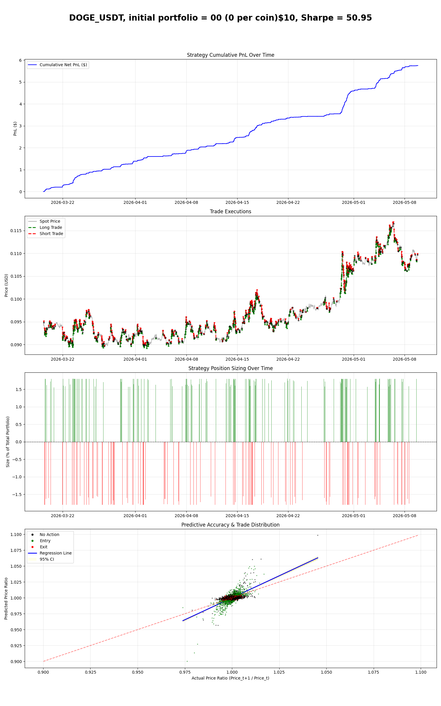
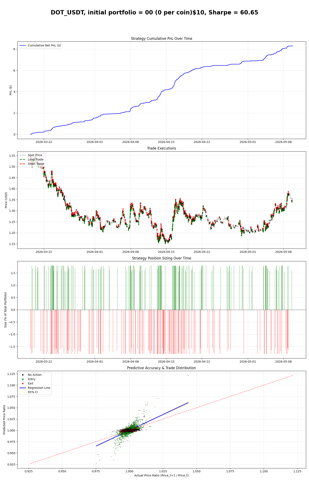
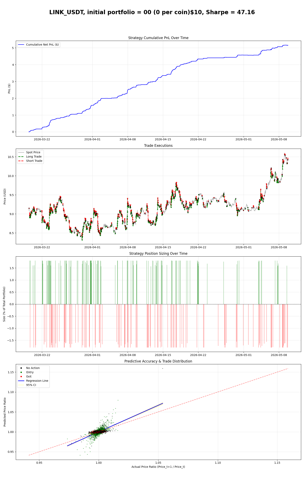
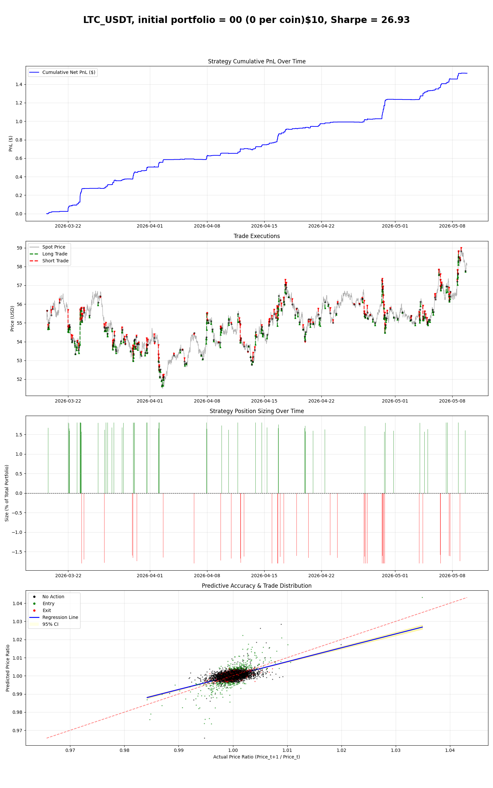

# New Model Backtest Report

|   Total Net PnL ($) |   Total Trades |   Win Rate (%) |   Profit Factor |   Sharpe Ratio (annual) |   Sortino Ratio |   Max Drawdown (%) |   Calmar Ratio |   Avg Win ($) |   Avg Loss ($) |   Total Fees Paid ($) | Symbol    |
|--------------------:|---------------:|---------------:|----------------:|------------------------:|----------------:|-------------------:|---------------:|--------------:|---------------:|----------------------:|:----------|
|                2.15 |            417 |          79.86 |          16.265 |                  32.833 |         261.619 |              -0.07 |        319.201 |          0.01 |             -0 |                  0.8  | BTC_USDT  |
|                2.28 |            355 |          83.94 |          16.93  |                  28.629 |         187.41  |              -0.14 |        166.986 |          0.01 |             -0 |                  0.7  | ETH_USDT  |
|                2.13 |            655 |          66.26 |           3.153 |                  22.859 |          52.375 |              -1.27 |         16.765 |          0.01 |             -0 |                  1.26 | SOL_USDT  |
|                0.23 |             79 |          65.82 |           4.296 |                   7.079 |          23.964 |              -0.16 |         14.731 |          0.01 |             -0 |                  0.14 | BNB_USDT  |
|                1.13 |            229 |          85.15 |          24.231 |                  25.344 |         207.991 |              -0.07 |        151.133 |          0.01 |             -0 |                  0.42 | XRP_USDT  |
|                6.42 |            879 |          85.67 |          19.486 |                  55.151 |         348.632 |              -0.15 |        438.19  |          0.01 |             -0 |                  2    | ADA_USDT  |
|                5.75 |            800 |          84.88 |          20.442 |                  50.951 |         376.453 |              -0.1  |        563.064 |          0.01 |             -0 |                  1.76 | DOGE_USDT |
|                8.29 |           1037 |          85.73 |          22.418 |                  60.648 |         359.195 |              -0.13 |        639.554 |          0.01 |             -0 |                  2.49 | DOT_USDT  |
|                5.15 |            756 |          84.79 |          18.433 |                  47.161 |         308.036 |              -0.18 |        285.315 |          0.01 |             -0 |                  1.65 | LINK_USDT |
|                1.52 |            340 |          76.18 |          11.706 |                  26.935 |         165.503 |              -0.13 |        121.509 |          0.01 |             -0 |                  0.63 | LTC_USDT  |

## Advanced Backtest Plots

### BTC_USDT

### ETH_USDT

### SOL_USDT

### BNB_USDT

### XRP_USDT

### ADA_USDT

### DOGE_USDT

### DOT_USDT

### LINK_USDT

### LTC_USDT

